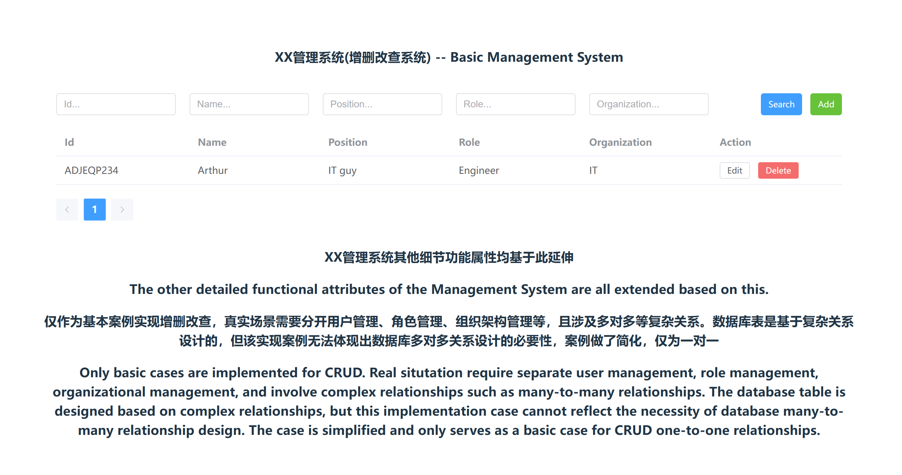

# Full-stack-web-project-JS-version

Full-stack web project, use to LEARN and SHOW, also my interest. BTW, Welcome to contact me.  

**After AI, I think it will kill many positions, because junior back-end developers engineer (CRUD guys), junior front-end developers engineer (UI component guys), junior test engineer and junior DevOps engineer can be replaced.**

**Coding language is not gap of different software engineer, and software engineer can focus on creative work, business abstraction, architecture construction, and performance optimization.** 

In the software filed, having a good idea and starting to work on it right away is becoming increasingly important.

I will directly describe my project and ideas in English, please ignore the grammar. I don't want to optimize the grammar like publish a research paper. LoL

The project is finished. Compared my first full-stack development project, this one use Node.js as back-end server.

HTML/CSS/JS(Vue) + Node.js to develop web project, back-end and front-end both use the JavaScript technology stack, which is also **most populer full stack web development tech in oversea**.

## 1.Database

### 1.1 Relational Database

#### 1.1.1 MySQL

First, let me clarify some easy topics.  
- MySQL Community (GPL) Downloads  
In the mysql website, there are many download links, but most of them are for 'MySQL Community (GPL) Downloads'. GPL mean GNU General Public License, so it is free for use anywhere, you don't need to worry about the risk of charge.
- what is 'MySQL'?  
In most sitatuation, the 'MySQL' we talk about is mean 'MySQL Community Server'. So when we talk about the mysql version is MySQL Community Server version.  
why I say this? Because I will talk about the mysql client version in the next topic, which is 'MySQL Workbench'. 
- MySQL Workbench  
In most sitatuation, we don't want to use the command line to operate the database, so we use the GUI to operate the database. I use the 'MySQL Workbench' to operate the MySQL server. BTW, there are many other clients in market, you can choose one.
- Why I clarify this?  
MySQL Community Server and MySQL Workbench is most use in the development. In many(LoL, in my opinion is most) sitatuation, they don't know which 'MySQL' talk about. MySQL Community Server has it own vsrsion, and MySQL Workbench has it own version too. So we need to choose match version for both two. 
- My project  
Besides download Community Server and Workbench in mysql website, they provide 'MySQL Installer' for windows developer, include server, workbench, and other mysql products. It is have two versions: '5.7.44' and '8.0.40' (Oct. 2024). Is it familiar to you? They always talk about 5.7 and 8.0 of MySQL vsesion is THIS!!!  
In my project, I choose 8.0.40.
- **Summery**  
**In my project, I use 8.0.40 version of MySQL Community Server and MySQL Workbench as the database and database maintenance tool.**

Sencondly, let me talk about the main database design ideas and maintan rules.  
- ID as Primary Key: auto increment id as primary key. Because it more efficient as index for serach. Also, it easy and usefull way of almost sitatuation.
- ID REFERENCE as Foreign Key: some tables have join relationship, use this to keep data complete.
- UUID (Universally Unique Identifier) as Fake(Logic) Primary Key: Prepare for data migration, data synchronization, database sharding, distributed architecture and so on. To keep the data unique in GLOBAL.
- NF (Normal Form): 1NF, 2NF, 3NF(I use), and some de-normalized.
- Maintan Rules One: Change the configuration of mysql server, open and edit my.ini file. I use to change the default path of data.
- Maintan Rules Two: Set up user roles.
- Maintan Rules Three: Backup data on time. I use Task Scheduler with mysqldump (In Linux is different way).
- **Summery**  
**In my project, sqlscript.sql describe the table struct**

## 2.Server Side (Back-end Development) & Browser Side (Front-end Development)
MEVN: MySQL / Express.js / Vue.js / Node.js

Points:

1. Vue.js & Vite 

2. Express & Node.js 

2. Restful Api

3. Including Create/Read/Update/Delete basic&complex funtional.

4. Other interesting points.

## 3.Preview
